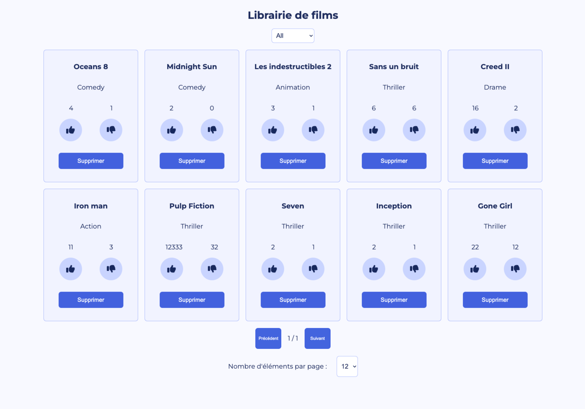

# Getting Started with Create React App

This project was bootstrapped with [Create React App](https://github.com/facebook/create-react-app).

## Available Scripts

In the project directory, you can run:

### `npm start`

Runs the app in the development mode.\
Open [http://localhost:3000](http://localhost:3000) to view it in your browser.

The page will reload when you make changes.\
You may also see any lint errors in the console.

### `npm run build`

Builds the app for production to the `build` folder.\
It correctly bundles React in production mode and optimizes the build for the best performance.

The build is minified and the filenames include the hashes.\
Your app is ready to be deployed!

See the section about [deployment](https://facebook.github.io/create-react-app/docs/deployment) for more information.

## librairie De Film - Projet personnel d'entrainement

J' ai listé les films dans des cartes avec: le titre en gras, la catégorie et une jauge type Youtube indiquant le ratio likes/dislikes. Les cartes sont côtes à côtes et responsive. Lorsque la fenêtre se réduit, les cartes sautent à la ligne suivante.

J'ai ajouté un bouton dans les cartes permettant de supprimer celle-ci.

J'ai ajouté un bouton toggle like/dislike.

J'ai ajouté un filtre par catégorie (de type multiselect) en supposant qu'on ne les connaisse pas à l'avance (il fallait donc les récupérer dynamiquement depuis les films). Quand tous les films d'une catégorie sont supprimés, celle-ci n'apparaît plus.

J'ai ajouter un système de pagination avec les fonctionnalités suivantes:

Boutons précédent/suivant
Choix du nombre d'élements affichés par page (4, 8 ou 12).

## Les technologies utilisées

- JavaScript
- React.js
- Redux